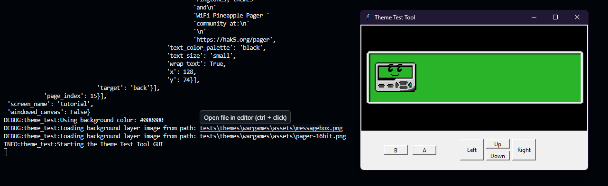
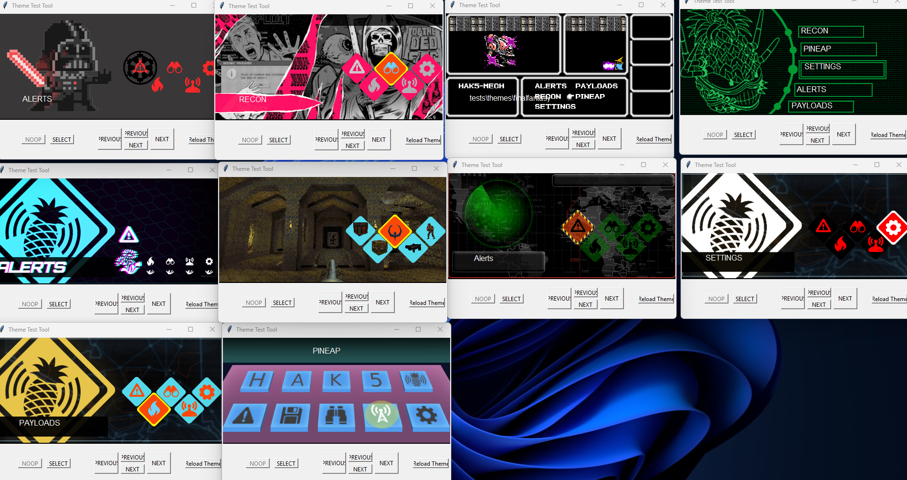
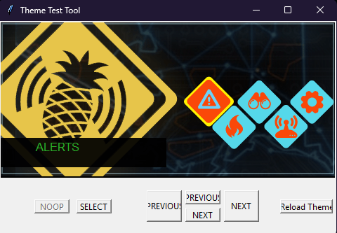
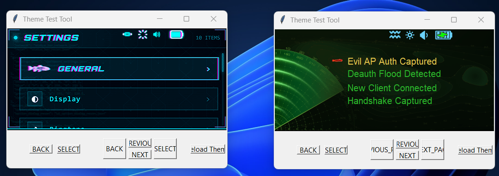

# Theme Test Tool

A Tkinter-based GUI tool for testing and visualizing WiFi Pineapple Pager themes. This tool loads theme data from JSON files and renders an interactive preview of menus, menu items, status bars, and assets.

## Overview

The Theme Test Tool allows you to:

- Load and display complete theme configurations
- Navigate through menu hierarchies using simulated pager buttons
- View menu items with selected/unselected states
- See status bars with battery, volume, brightness, and vibrate indicators
- Test image rendering and color palette recoloring
- Debug theme structure and configurations

## Installation

1. Install Python 3.6 or higher
2. Install required dependencies:

```bash
pip install -r requirements.txt
```

## Usage

### Basic Command

```bash
python theme_test.py --theme <path/to/theme>
```

### Command Line Arguments

| Argument | Short | Type | Required | Default | Description |
|----------|-------|------|----------|---------|-------------|
| `--theme` | | string | Yes | — | Path to the theme directory containing `theme.json` |
| `--menu-target` | `-i` | string | No | `dashboard_path` | Initial menu to load when starting the tool |
| `--verbose` | `-v` | flag | No | — | Enable verbose logging (INFO level) |
| `--debug` | `-d` | flag | No | — | Enable debug mode with detailed logging (DEBUG level) |

### Examples

```bash
# Load the wargames theme with verbose output
python theme_test.py --theme ./tests/themes/wargames/ -v

# Load the cambridge theme in debug mode
python theme_test.py --theme ./tests/themes/cambridge/ -d

# Load a specific starting menu
python theme_test.py --theme ./tests/themes/dedsec/ --menu-target settings_path
```

## GUI Controls

The tool provides an on-screen simulation of a pager interface with the following buttons:

| Button | Function | Default Mapping |
|--------|----------|-----------------|
| **A** | Select current menu item or confirm action | `select` |
| **B** | Go back to previous menu | `back` |
| **Up** | Move to previous menu item (or previous page) | `previous` |
| **Down** | Move to next menu item (or next page) | `next` |
| **Left** | Move to previous page (if multi-page menu) | `previous_page` |
| **Right** | Move to next page (if multi-page menu) | `next_page` |
| **Reload Theme** | Reload theme from disk without restarting | — |

Button mappings are customizable per menu via the `button_map` property in the theme JSON.

## How It Works

### 1. Theme Loading (`load_theme`)

When the tool starts, it loads the main theme file:

1. Opens `<theme-path>/theme.json` with UTF-8 encoding
2. Recursively expands all relative paths to absolute paths
3. Extracts the color palette for later use
4. Returns expanded theme data

### 2. Path Expansion (`expand_dict`)

Theme files contain relative paths like `assets/image.png`. The expansion process:

1. Iterates through all dictionary keys and values
2. For string values, attempts to resolve them as file paths relative to the theme root
3. If the path points to a JSON file, loads and recursively expands it
4. If the path points to an image or asset, keeps the resolved absolute path
5. Recursively processes nested dictionaries and lists

**UTF-8 Encoding:** All JSON file loads explicitly use UTF-8 encoding to support special characters (emoji, Japanese, etc.) and prevent `UnicodeDecodeError` on Windows systems.

### 3. Menu Creation (`create_menus`)

After expansion, the tool extracts menu dictionaries:

1. Scans expanded theme data for dictionaries containing `screen_name` field
2. Creates `generic_menu` objects for each menu found
3. Stores menus in a dictionary keyed by their name
4. Returns the complete menu collection

### 4. Status Bar Creation (`create_status_bars`)

Status bars are created similarly:

1. Loads status bar configurations from `theme_data['status_bars']`
2. Creates `generic_menu` objects for each status bar
3. Stores for later rendering

### 5. Menu Rendering (`render_menu`)

When loading a menu, the tool displays:

1. **Background:** Fills canvas with `background_color` from menu data
2. **Layers:** Renders image layers on top of background
3. **Title:** Displays menu title text at the top
4. **Menu Items:** Drawn by separate `draw_menu_items()` function
5. **Status Bar:** Drawn by separate `draw_status_bar()` function

### 6. Menu Item Rendering (`draw_menu_items`)

For each menu item:

1. Checks if the item is currently selected (highlighted)
2. Loads the appropriate layer(s) - selected or unselected
3. Applies color palette recoloring if `recolor_palette` is specified
4. Renders text with specified font and colors
5. Positions items at coordinates from menu data

### 7. Status Bar Rendering (`draw_status_bar`)

Displays system status information:

1. Iterates through `status_bar_items` from the status bar configuration
2. For each item (Battery, Volume, Brightness, Vibrate):
   - Loads the appropriate image based on current state
   - Applies recoloring with the specified palette color
   - Renders at the specified position

### 8. Navigation (`use_button_map`)

Button presses trigger navigation:

1. Looks up button action in `button_map`
2. Performs appropriate action:
   - `select`: Load selected menu item's target menu
   - `back`: Return to previous menu
   - `next`/`previous`: Navigate menu items or pages
   - `next_page`/`previous_page`: Navigate between pages in multi-page menus
3. Updates global state and re-renders the display

## Architecture

### Key Components

**Global State Variables:**
- `menu_target`: Current menu identifier (string)
- `menu_path`: Breadcrumb trail of menus visited (list)
- `selected_menu_item`: Index of currently selected menu item
- `selected_page`: Index of currently displayed page
- `button_map`: Mapping of button names to actions
- `menu_items`: List of items in current menu
- `pages`: List of pages in current menu
- `palette`: Color palette dictionary for recoloring

**Core Classes:**

`generic_menu`
- Container for menu or status bar data
- Loads from JSON file or dictionary
- Expands relative paths to absolute
- Attributes: `menu_data`, `menu_items`, `pages`

`page`
- Represents a single page in a multi-page menu
- Stores page-specific data

### Data Flow

```
theme.json (input)
    ↓
load_theme()          [load and expand paths]
    ↓
expand_dict()         [resolve all relative paths and load nested JSON]
    ↓
create_menus()        [extract menu dictionaries]
    ↓
load_menu()           [populate global state]
    ↓
render_menu()         [draw background and layers]
    ↓
draw_menu_items()     [draw menu items with recoloring]
    ↓
draw_status_bar()     [draw status indicators]
    ↓
GUI Display           [Tkinter canvas]
```

### Button Input Flow

```
Button Click
    ↓
on_*_button()         [button event handler]
    ↓
use_button_map()      [lookup action from button_map]
    ↓
Navigation Function   [next/previous/select/back/etc.]
    ↓
update_menu()         [change menu_target]
    ↓
load_menu()           [populate state]
    ↓
Re-render Display     [update canvas]
```

## Theme JSON Structure

Themes follow this basic structure:

```json
{
  "color_palette": {
    "color_name": {"r": 255, "g": 128, "b": 0},
    ...
  },
  "status_bars": {
    "default": "path/to/statusbar.json",
    ...
  },
  "dashboard_path": {
    "screen_name": "Dashboard",
    "background": {
      "background_color": {"r": 0, "g": 0, "b": 0},
      "layers": [...]
    },
    "menu_items": [...],
    "button_map": {...},
    "status_bar": "default"
  },
  "other_menu_path": {...}
}
```

## Image Recoloring

The tool supports dynamic image recoloring using the color palette:

1. When a menu item has `recolor_palette` property, the specified color is looked up
2. `recolor_image()` creates a copy of the image
3. Iterates through all pixels
4. Replaces all non-transparent pixels with the palette color
5. Renders the recolored image

This allows the same image asset to display in different colors without creating separate files.

## Features

✅ **Theme Loading** - Loads complete theme hierarchies from JSON
✅ **Path Resolution** - Handles relative paths with automatic expansion
✅ **UTF-8 Support** - Correctly handles special characters in JSON files
✅ **Menu Navigation** - Navigate through nested menu structures
✅ **Multi-page Menus** - Support for menus split across multiple pages
✅ **Image Rendering** - Displays PNG images with proper transparency
✅ **Color Recoloring** - Dynamically recolor images using palette colors
✅ **Status Bars** - Display system status (battery, volume, brightness, vibrate)
✅ **Button Mapping** - Customizable button-to-action mappings per menu
✅ **Debug Logging** - Verbose output for troubleshooting theme issues
✅ **Hot Reload** - Reload theme without restarting via "Reload Theme" button

## Dependencies

- `tkinter` - GUI framework
- `Pillow (PIL)` - Image processing and manipulation
- `pyglet` - Font management
- `json` - JSON file parsing (standard library)
- `logging` - Debug output (standard library)
- `argparse` - Command line argument parsing (standard library)

## Troubleshooting

### `UnicodeDecodeError: 'charmap' codec can't decode byte`

**Cause:** JSON files contain UTF-8 characters (emoji, Japanese, etc.) and Windows is trying to read them with the default cp1252 encoding.

**Solution:** The tool now explicitly uses UTF-8 encoding for all JSON file loads. If you still encounter this error, ensure your Python version is up to date.

### Menu not found

**Error:** `Couldn't find menu target 'X' in menus`

**Cause:** The specified `--menu-target` doesn't exist in the theme.

**Solution:** Check the theme's menu names or use the verbose flag to see all available menus.

### Images not rendering

**Cause:** Path expansion failed or image file is missing/corrupted.

**Solution:** Use `--debug` flag to see detailed logging about which files are being loaded and their full resolved paths.

### Button states not updating

**Cause:** The menu's `button_map` contains invalid action names.

**Solution:** Check the menu JSON to ensure button mappings use valid action names: `select`, `back`, `next`, `previous`, `next_page`, `previous_page`, `noop`.

## Development Notes

### Global Variables

All navigation state is stored in module-level global variables. Functions that modify state must include `global` declarations at their start.

### Logging

The tool uses Python's logging module with configurable levels:
- **WARNING** (default): Errors and important messages only
- **INFO** (`-v`): Process flow and user actions
- **DEBUG** (`-d`): Detailed variable states and data expansion

### Thread Safety

The tool is single-threaded with a Tkinter event loop. All rendering happens on the main thread.

### Canvas Rendering

The Tkinter Canvas is used for all visual rendering. Images are stored in `canvas_screen.images` list to prevent garbage collection.

## Screenshots

### Really at the start of development:



### Testing to load all themes (before adding the Font):





### Current state:



## Future Improvements

- [ ] Building a state machine of the pager for more accurate simulation
- [ ] Recreating the font of the Pager. Currently using DejaVu Sans wich is in the files of the pager but doesn't seam to be the one used in the UI.
- [ ] Make status bar states configurable (currently hardcoded)
- [ ] Add error recovery for missing menu targets
- [ ] GUI selector for choosing theme path
- [ ] Keyboard shortcuts for common actions
- [ ] Export screenshots of menus
- [ ] Theme validation tool
